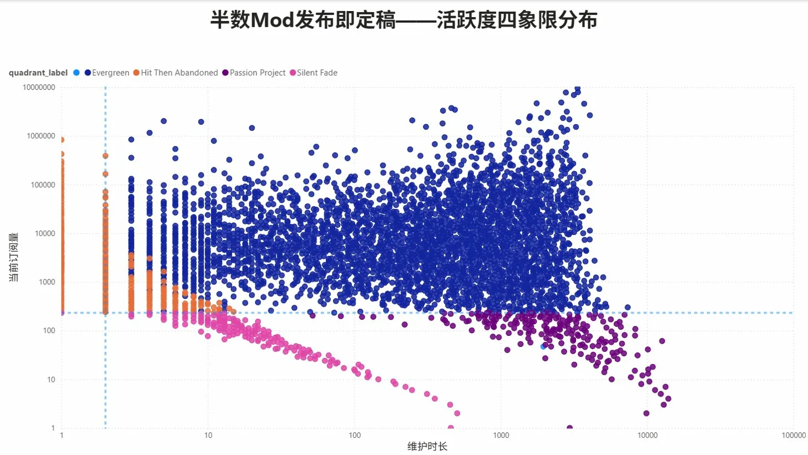
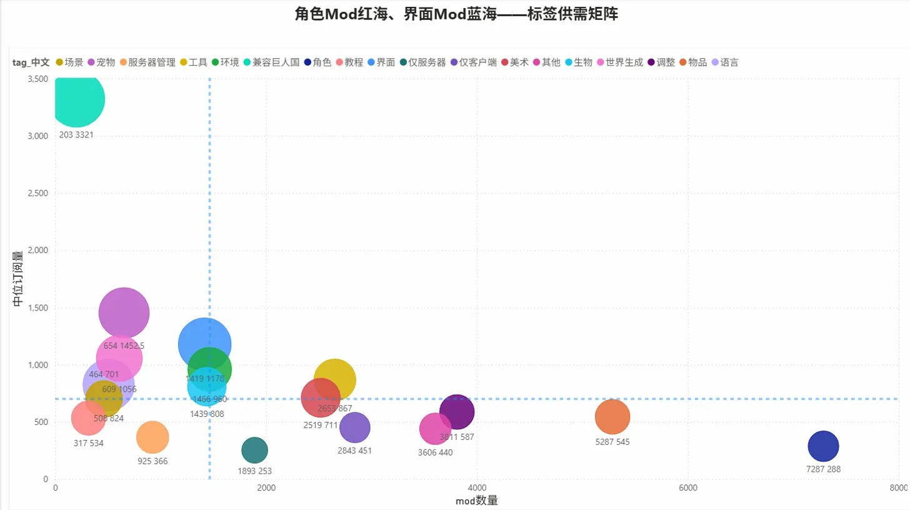
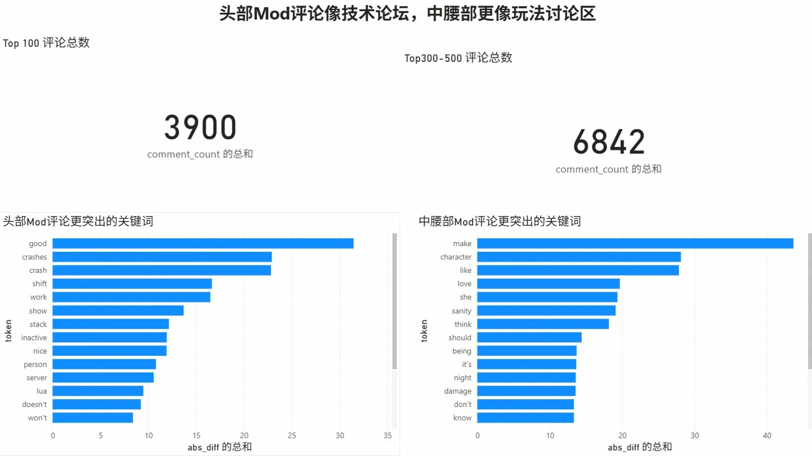
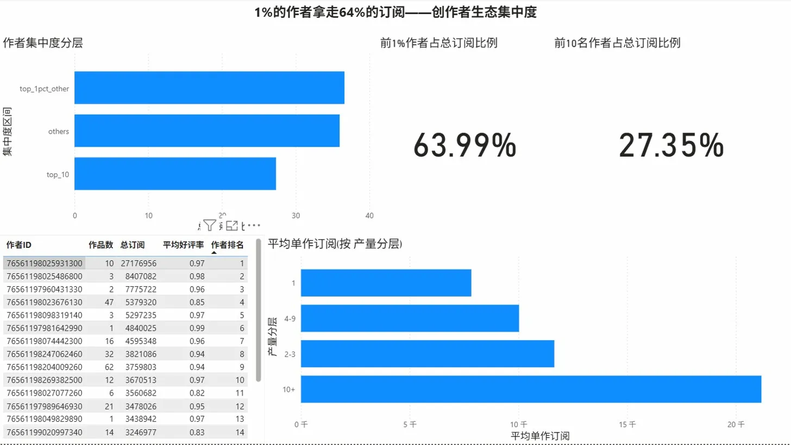

# Steam Workshop DST Mod 生态数据分析

对 Steam 创意工坊中《饥荒联机版》(Don't Starve Together) 的 22,920 个 Mod 进行全量采集与生态分析，覆盖 Mod 活跃度、标签供需、评论文本、作者集中度四个维度。

## 核心发现

**半数 Mod 发布即定稿** — 维护天数中位数仅为 1 天，超过 10,000 个 Mod 从未更新过。



**角色 Mod 是最拥挤的红海** — 7,287 个角色 Mod，中位订阅仅 288；而界面 Mod 仅 1,419 个，中位订阅 1,178，是最明显的蓝海。



**头部 Mod 评论像技术论坛** — Top 100 Mod 评论高频词为 crash、lua、server；中腰部 Mod 评论高频词为 character、sanity、damage，更偏玩法讨论。



**1% 的作者拿走 64% 的订阅** — 9,626 位作者中，前 97 人贡献了近三分之二的总订阅量。高产不等于高质，但做到 10 个以上 Mod 的作者平均单作订阅是单作作者的 2.7 倍。



## 技术栈

| 环节 | 工具 |
|------|------|
| 数据采集 | Python + Steam Web API + requests/BeautifulSoup |
| 数据存储 | MySQL |
| 数据清洗 | Python (pandas) + SQL |
| 文本分析 | Python (nltk / collections) |
| 可视化 | Power BI |
| 版本管理 | Git |

## 数据规模

- Mod 基础信息：22,920 条（Steam Web API 全量采集）
- 评论数据：17,782 条（Top 500 Mod 公开页面爬取）
- 作者数据：9,626 位（从 Mod 数据聚合）
- 采集时间：2026-03-19

## 项目结构

```
dst-mod-analysis/
├── README.md
├── requirements.txt
├── .gitignore
├── scripts/                    # 采集、清洗、分析、导出脚本
│   ├── 01_collect_workshop.py      # 公开页面采集（验证用）
│   ├── 02_collect_api_full.py      # API 全量分页采集
│   ├── 03_import_api_csv_to_mysql.py   # CSV 导入 MySQL
│   ├── 04_collect_top_comments.py  # Top 500 评论爬取
│   ├── 05_analyze_comment_text.py  # 评论文本分析
│   ├── 06_export_powerbi_dashboard.py  # Dashboard 数据导出
│   ├── steam_api.py                # API 调用模块
│   ├── steam_workshop.py           # 公开页面解析模块
│   ├── comment_text_analysis.py    # 文本分析模块
│   └── dashboard_export.py         # Dashboard 导出模块
├── sql/
│   ├── create_tables.sql           # 建表 DDL
│   └── analysis_queries.sql        # 四个分析模块的核心 SQL
├── docs/
│   ├── findings.md                 # 分析结论与业务建议
│   ├── metric_definitions.md       # 指标定义与口径说明
│   └── data_validation.md          # 数据源验证记录
├── data/
│   ├── sample/                     # 少量样本数据（可复现验证）
│   └── processed/
│       ├── analysis/               # 分析结果 CSV
│       └── dashboard/              # Power BI 数据层 CSV
├── dashboard/
│   ├── README.md                   # Power BI 建模说明
│   └── screenshots/                # Dashboard 截图
└── tests/                          # 单元测试（12 项通过）
```

## 分析模块

### 1. 活跃度四象限

以订阅量中位数（232）和维护时长中位数（1 天）为分界，将 Mod 分为常青树、爆款弃坑、用爱发电、沉默消亡四类。发现维护时长中位数极低，说明多数 Mod 属于"一次性发布"性质，因此将"常青树"重新定义为"长寿高订阅"而非"近期活跃维护"。

### 2. 标签供需矩阵

对 19 个稳定标签（mod_count ≥ 100）进行供需分析。需求主轴使用中位订阅数而非均值，避免头部爆款扭曲判断。识别出 interface、worldgen、pet 为蓝海标签，character、server_only_mod 为红海标签。

### 3. 评论文本分析

对 Top 100 与 Rank 300-500 两组 Mod 的英文评论进行分词对比。使用 Steam 原生评论结构，不额外训练情感模型。发现头部 Mod 评论集中在稳定性与兼容性问题，中腰部 Mod 评论集中在角色机制与玩法体验。

### 4. 作者生产力分析

按作者聚合 Mod 数量、总订阅、好评率等指标。Pearson 相关性接近零，但分层后发现 10+ Mod 作者的平均单作订阅为单作作者的 2.7 倍，体现存活者效应。前 1% 作者占总订阅 63.99%，生态高度集中。

## 如何复现

1. 安装依赖：`pip install -r requirements.txt`
2. 申请 [Steam Web API Key](https://steamcommunity.com/dev/apikey)
3. 配置 MySQL 数据库，执行 `sql/create_tables.sql`
4. 按脚本编号顺序执行 `scripts/01_` 到 `scripts/06_`
5. 将 `data/processed/dashboard/powerbi_20260319/` 下的 CSV 导入 Power BI Desktop

## 局限性

- 订阅数作为需求代理指标，实际反映的是历史累计热度而非当前活跃需求
- 评论采集受 Steam 限速影响，Top 500 中仅 199 个 Mod 成功获取评论样本
- 好评率在全局加权口径下为 96%，区分度有限；作者层面的平均好评率更有参考价值
- 所有数据为 2026-03-19 单次快照，无时间序列对比
